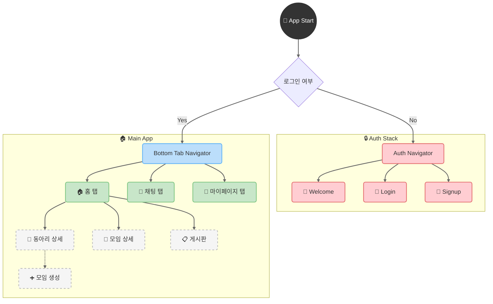

 

### 이웃과 함께 성장하는 커뮤니티 플랫폼 (React Native)

 

 

---
  

## 📖 프로젝트 개요

### "당신의 이웃이 당신의 친구가 되는 순간"

 

**NEIGHBUS**는 기술을 통해 이웃 간의 단절을 해결하고, 오프라인 만남으로 확장되는 진정한 커뮤니티를 구축하는 것을 목표로 하는 모바일 애플리케이션입니다.

 

| 🗓️ **개발 기간** | 👥 **팀 구성** | 🎯 **목표** | 📈 **결과** |
| :---: | :---: | :---: | :---: |
| 2025.10 ~ 2025.12 | 4인 (풀스택) | 지역 커뮤니티 활성화 앱 | MVP 완성 |

   

### "함께 성장하는 개발자들"

 

<table>
<tr>
<td align="center" width="25%">
<a href="https://github.com/wjdgkr3386" target="_blank">
 
<b>팀장</b> 
시큐리티 / AWS(S3)
</a>
</td>
<td align="center" width="25%">
<a href="https://github.com/happycat12389" target="_blank">
 
<b>팀원</b> 
회원가입 / 모임
</a>
</td>
<td align="center" width="25%">
<a href="https://github.com/library-min" target="_blank">
 
<b>팀원</b> 
관리자 / UX/UI 
</a>
</td>
<td align="center" width="25%">
<a href="https://github.com/Mingyu7" target="_blank">
 
<b>팀원</b> 
웹 소켓 / 소셜 로그인
</a>
</td>
</tr>
</table>

  

---
  

## 💡 핵심 가치

### "단순한 앱을 넘어, 사회적 연결을 위한 플랫폼"

 

<table>
<tr>
<td align="center" width="33%">

<h3>🤝 연결</h3>

온라인에서 오프라인으로 확장되는 이웃 커뮤니티

</td>
<td align="center" width="33%">

<h3>📍 지역성</h3>

내 주변의 검증된 장소와 모임 정보

</td>
<td align="center" width="33%">

<h3>📱 사용자 경험</h3>

네이티브처럼 부드럽고 직관적인 사용성

</td>
</tr>
</table>

 

---
  

## 🎯 기술적 도전과 해결

### "React Native 환경에서의 기술적 문제 해결 기록"

 

### 🔥 Challenge 1: 실시간 채팅 기능 구현

> **📌 과제**
> React Native 환경에서 끊김 없는 안정적인 실시간 채팅을 구현해야 했습니다.

- **💡 해결**: **`@stomp/stompjs`**와 **`WebView`**를 결합하여 하이브리드 방식으로 해결했습니다.
  - `WebView` 내에서 WebSocket 연결 및 STOMP 프로토콜 처리를 전담하도록 브릿지 생성.
  - React Native는 `WebView`와 `postMessage`로 통신하여 네이티브 의존성 최소화.
- **📊 결과**: 복잡한 네이티브 모듈 설정 없이 **안정적인 실시간 채팅 기능**을 구현하고 앱의 리소스 부담을 줄였습니다.

 

### 🔥 Challenge 2: 전역 상태 및 인증 관리

> **📌 과제**
> 앱 전반에 걸쳐 사용자 로그인 상태를 일관되게 유지하고, 앱 재시작 시에도 자동 로그인이 되어야 했습니다.

- **💡 해결**: **`React Context API`**와 **`AsyncStorage`**를 조합했습니다.
  - **UserContext**: 로그인 시 사용자 정보와 토큰을 메모리에 저장하여 앱 전역에서 즉시 접근.
  - **AsyncStorage**: 인증 토큰을 디바이스에 암호화하여 영구 저장, 앱 재시작 시 자동 복구.
- **📊 결과**: 무거운 외부 라이브러리(Redux 등) 없이 React 내장 기능만으로 **가볍고 효율적인 인증 시스템**을 구축했습니다.

 

### 🔥 Challenge 3: 외부 API 및 네이티브 기능 연동

> **📌 과제**
> 모임 장소 선택 시, 지도에 표시된 좌표(위도/경도)를 사용자가 이해하기 쉬운 '주소 텍스트'로 변환해야 했습니다.

- **💡 해결**: **`react-native-maps`**와 **`Google Maps Geocoding API`**를 연동했습니다.
  - `react-native-maps` UI에서 사용자가 핀을 이동시켜 정확한 좌표 획득.
  - 해당 좌표를 **Google Geocoding API**에 비동기 전송하여 도로명 주소로 변환.
- **📊 결과**: 단순 지도 표시를 넘어, **역지오코딩(Reverse Geocoding)** 기능을 통해 사용자가 모임 장소를 직관적으로 설정할 수 있게 되었습니다.

 

---
  

## ⚡ 주요 기능

| 기능 | 설명 |
| :--- | :--- |
| **🏠 홈** | 카테고리별 동아리 목록, 신규 모임 및 인기 게시글 표시 |
| **🔐 인증** | 이메일/비밀번호 기반 로그인 및 회원가입, 자동 로그인 |
| **🎪 동아리** | 동아리 생성, 검색, 가입 및 상세 정보 확인 |
| **📅 모임** | 동아리 내 오프라인 모임 생성, 지도 기반 장소 지정 |
| **💬 실시간 채팅** | STOMP + WebSocket 기반 실시간 채팅 및 친구 관리 |
| **📝 게시판** | 자유게시판, 갤러리, 공지사항 기능 (글, 댓글, 반응) |
| **👤 마이페이지** | 내 정보 수정, 가입한 동아리 및 작성 글 목록 확인 |

 

---
  

## 🏗️ 아키텍처

### 🛠️ 기술 스택

| Category | Technologies |
| :--- | :--- |
| **Core** | `React`, `React Native`, `TypeScript` |
| **Navigation** | `React Navigation` |
| **State & Data** | `AsyncStorage`, `React Context API` |
| **Real-time** | `@stomp/stompjs`, `react-native-webview` |
| **Map & Location**| `react-native-maps`, `Google Maps Geocoding API` |
| **DevOps** | `ESLint`, `Prettier` |

 

### 🧭 네비게이션 흐름

`React Navigation`을 사용하여 앱의 화면 전환을 체계적으로 관리합니다.

 

---
  

## 🚀 시작하기

### "5분 안에 로컬 환경에서 앱 실행하기"

 

### 📋 사전 요구사항

| Icon | Tool / Platform | Description |
| :---: | :--- | :--- |
| 📦 | **[Node.js](https://nodejs.org/)** | LTS 버전 권장 |
| 👀 | **[Watchman](https://facebook.github.io/watchman/)** | macOS 파일 시스템 감시 도구 |
| 👩‍💻 | **[Xcode](https://developer.apple.com/xcode/)** | iOS 개발용 |
| 🤖 | **[Android Studio](https://developer.android.com/studio)** | Android 개발용 |
| 🍫 | **[CocoaPods](https://cocoapods.org/)** | iOS 의존성 관리자 |

> React Native 개발 환경 설정에 대한 자세한 내용은 [공식 문서](https://reactnative.dev/docs/environment-setup)를 참고하세요.

 

### ⚡ 설치 및 실행

| Step | Command | Description |
| :---: | :--- | :--- |
| 1️⃣ | `git clone https://github.com/your-username/neighbusapp-main.git` `cd neighbusapp-main` | 소스코드를 복제하고 디렉토리로 이동합니다. |
| 2️⃣ | `npm install` | 프로젝트에 필요한 의존성을 설치합니다. |
| 3️⃣ | `cd ios && pod install && cd ..` | iOS 네이티브 모듈 의존성을 설치합니다. |
| 4️⃣ | (에디터) `src/config.ts` | `BASE_URL`을 실제 백엔드 서버 주소로 변경합니다. |
| 5️⃣ | `npm run ios` Or `npm run android` | 개발 서버를 시작하고 앱을 시뮬레이터에서 실행합니다. |

 

---
 

 

**Made with ❤️ by NEIGHBUS Team**

 

 

[⬆️ Back to Top](#top)

