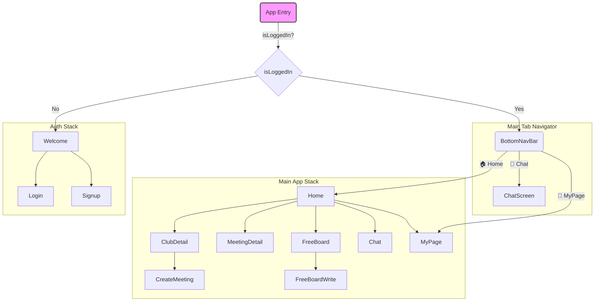

<div align="center">

<!-- 애니메이션 배너 -->


<br/>

### 이웃과 함께 성장하는 커뮤니티 플랫폼 (React Native)

<br/>

<!-- 타이핑 애니메이션 -->
[](https://git.io/typing-svg)

<br/>

[](https://reactnative.dev/)
[](https://www.typescriptlang.org/)
[](https://reactnavigation.org/)
[](https://stomp-js.github.io/)

<br/>

```
┌─────────────────────────────────────────────────────────────────┐
│  "기술로 연결하고, 만남으로 완성하는 지역 커뮤니티의 미래"        │
└─────────────────────────────────────────────────────────────────┘
```

<br/>

[📖 프로젝트 개요](#-프로젝트-개요) • 
[💡 핵심 가치](#-핵심-가치) •
[🎯 기술적 도전](#-기술적-도전과-해결) • 
[🏗️ 아키텍처](#️-앱-아키텍처) • 
[⚡ 주요 기능](#-주요-기능) • 
[📡 API](#-api-문서) •
[🚀 시작하기](#-시작하기)

<br/>

</div>

---

<br/>

## 📖 프로젝트 개요

<div align="center">

### "당신의 이웃이 당신의 친구가 되는 순간"

<br/>

</div>

### 🎯 프로젝트 미션

현대 도시에서는 **같은 건물에 살면서도 서로를 모르는** 시대입니다.  
NEIGHBUS는 이러한 사회적 단절을 해결하고자 합니다.

**기술을 통해 이웃을 연결하고, 오프라인 만남을 통해 진정한 커뮤니티를 구축합니다.**

<br/>

### 📊 프로젝트 요약

<table>
<tr>
<td align="center" width="25%"><b>🗓️ 개발 기간</b></td>
<td align="center" width="25%"><b>👥 팀 구성</b></td>
<td align="center" width="25%"><b>🎯 목표</b></td>
<td align="center" width="25%"><b>📈 결과</b></td>
</tr>
<tr>
<td align="center">2025.10.03 ~ 2025.12.31<br/>(3개월)</td>
<td align="center">프론트엔드(본인)</td>
<td align="center">지역 커뮤니티<br/>활성화 모바일 앱</td>
<td align="center">MVP 완성<br/>포트폴리오 제작</td>
</tr>
</table>

<br/>

---

<br/>

## 💡 핵심 가치

<div align="center">

### "단순한 앱을 넘어, 사회적 연결을 위한 플랫폼"

<br/>

<table>
<tr>
<td align="center" width="33%">

<h3>🤝 연결 (Connection)</h3>
<p>온라인에서 시작해<br/>오프라인으로 확장되는<br/>진정한 이웃 커뮤니티</p>
</td>
<td align="center" width="33%">

<h3>📍 지역성 (Locality)</h3>
<p>내 주변의<br/>검증된 장소와 모임 정보로<br/>지역 생활의 가치 증대</p>
</td>
<td align="center" width="33%">

<h3>📱 사용자 경험 (UX)</h3>
<p>네이티브 앱처럼<br/>부드럽고 직관적인<br/>사용자 경험 제공</p>
</td>
</tr>
</table>

</div>

<br/>

---

<br/>

## 🎯 기술적 도전과 해결

<div align="center">

### "React Native 환경에서의 기술적 문제 해결 기록"

</div>

<br/>

### 🔥 Challenge 1: 실시간 채팅 기능 구현

<table>
<tr>
<td width="30%" align="center"><b>📌 과제</b></td>
<td width="70%">
React Native 환경에서 네이티브 WebSocket을 직접 사용하기보다, 안정적이고 검증된 STOMP 프로토콜을 통해 실시간 채팅을 구현해야 했습니다.
</td>
</tr>
<tr>
<td align="center"><b>💡 해결</b></td>
<td>
<b>`@stomp/stompjs`와 `WebView`를 결합</b>하여 문제를 해결했습니다.<br/>
• `WebView` 내에서 WebSocket 연결과 STOMP 프로토콜 처리를 전담하는 HTML/JS 브릿지를 생성했습니다.<br/>
• React Native에서는 `WebView`의 `postMessage`와 `onMessage`를 통해 메시지를 주고받는 방식으로 통신하여, 네이티브 코드 의존성을 최소화하고 안정성을 확보했습니다.
</td>
</tr>
<tr>
<td align="center"><b>📊 결과</b></td>
<td>
복잡한 네이티브 모듈 설정 없이 <b>안정적인 실시간 채팅 기능</b>을 구현했으며, 웹소켓 연결 관리를 `WebView`에 위임하여 앱의 부담을 줄였습니다.
</td>
</tr>
</table>

<br/>

### 🔥 Challenge 2: 전역 상태 및 인증 관리

<table>
<tr>
<td width="30%" align="center"><b>📌 과제</b></td>
<td width="70%">
앱 전반에 걸쳐 사용자의 로그인 상태와 프로필 정보를 일관되게 유지하고, 앱을 재시작해도 로그인 상태가 유지되어야 했습니다.
</td>
</tr>
<tr>
<td align="center"><b>💡 해결</b></td>
<td>
<b>`React Context API`와 `AsyncStorage`를 조합</b>하여 상태 관리 시스템을 구축했습니다.<br/>
• **UserContext**: 로그인 시 사용자 정보와 인증 토큰을 Context에 저장하여, 앱 내 모든 컴포넌트가 쉽게 접근할 수 있도록 했습니다.<br/>
• **AsyncStorage**: 인증 토큰을 디바이스의 영구 저장소에 저장하여, 앱 실행 시 토큰 유무를 확인하고 자동으로 로그인 상태를 복원하는 로직을 구현했습니다.
</td>
</tr>
<tr>
<td align="center"><b>📊 결과</b></td>
<td>
Redux와 같은 외부 라이브러리 없이 React 내장 기능만으로 <b>효율적인 전역 상태 및 인증 관리 시스템</b>을 구축했습니다.
</td>
</tr>
</table>

<br/>

### 🔥 Challenge 3: 외부 API 및 네이티브 기능 연동

<table>
<tr>
<td width="30%" align="center"><b>📌 과제</b></td>
<td width="70%">
모임 장소 선택 시, 위도/경도 좌표를 사람이 읽을 수 있는 주소로 변환하고, 지도에 정확히 표시해야 했습니다.
</td>
</tr>
<td align="center"><b>💡 해결</b></td>
<td>
<b>`react-native-maps`와 `Google Maps Geocoding API`를 연동</b>했습니다.<br/>
• `react-native-maps`의 `onPress` 이벤트로 사용자가 선택한 위치의 위도/경도 좌표를 얻었습니다.<br/>
• 해당 좌표를 **Google Geocoding API**에 전송하여 주소 정보를 받아오고, 이를 화면에 표시하여 사용자 경험을 향상시켰습니다.
</td>
</tr>
<tr>
<td align="center"><b>📊 결과</b></td>
<td>
단순한 지도 표시를 넘어, <b>좌표-주소 변환 기능</b>을 통해 사용자가 모임 장소를 더 명확하게 인지하고 설정할 수 있도록 개선했습니다.
</td>
</tr>
</table>

<br/>

---

<br/>

## 🏗️ 앱 아키텍처

### 🛠️ 기술 스택

| Category | Technology & Purpose |
|---|---|
| **Core** |   <br/> ∙ **React & React Native**: 크로스플랫폼 앱 개발<br/> ∙ **TypeScript**: 타입 안정성을 통한 코드 품질 향상 |
| **Navigation** | <br/> ∙ **React Navigation**: 스택 기반의 화면 전환 및 관리 |
| **State & Data** | <br/> ∙ **AsyncStorage**: 사용자 토큰, 설정 등 비동기 로컬 데이터 저장<br/> ∙ **React Context API**: 전역 사용자 정보 및 상태 관리 |
| **Real-time** |  <br/> ∙ **@stomp/stompjs & WebView**: WebSocket을 이용한 실시간 채팅 기능 구현 |
| **UI/UX** |   <br/> ∙ **Vector Icons**: 다양한 아이콘 사용<br/> ∙ **Calendars / Date Picker**: 날짜 선택 및 캘린더 UI<br/> ∙ **Image Picker**: 갤러리 및 프로필 이미지 선택<br/> ∙ **Pell Rich Editor / Render HTML**: 게시판 글 작성 및 HTML 렌더링 |
| **External APIs** | <br/>∙ **Google Maps Geocoding API**: 좌표를 주소로 변환 |
| **DevOps** |  <br/> ∙ **ESLint & Prettier**: 코드 스타일 및 컨벤션 자동화 |

<br/>

### 🧭 네비게이션 흐름

`React Navigation`을 사용하여 앱의 화면 전환을 관리합니다.



<br/>

---

<br/>

## ⚡ 주요 기능

<div align="center">

### "사용자 경험을 최우선으로 설계된 기능들"

</div>

<br/>

| 기능 | 스크린 | 설명 |
|---|---|---|
| **🏠 홈** | `HomeScreen.tsx` | - 카테고리별 동아리 목록<br/>- 신규 모임 및 인기 게시글 표시 |
| **🔐 인증** | `LoginScreen.tsx`<br/>`SignupScreen.tsx` | - 자체 이메일/비밀번호 기반 로그인 및 회원가입<br/>- AsyncStorage를 통한 로그인 상태 유지 |
| **🎪 동아리** | `ClubCreateScreen.tsx`<br/>`ClubDetailScreen.tsx` | - 동아리 생성, 검색, 가입 기능<br/>- 동아리 상세 정보 및 멤버 목록 확인 |
| **📅 모임** | `CreateMeetingScreen.tsx`<br/>`MeetingDetailScreen.tsx` | - 동아리 내 오프라인 모임 생성<br/>- 지도(react-native-maps)를 통한 장소 지정<br/>- 모임 참여 및 참여자 관리 |
| **💬 실시간 채팅** | `ChatScreen.tsx` | - STOMP + WebSocket 기반 실시간 채팅<br/>- 친구 목록 및 1:1 채팅방 기능 |
| **📝 게시판** | `FreeBoardScreen.tsx`<br/>`GalleryScreen.tsx` | - 자유게시판, 갤러리, 공지사항<br/>- Pell Rich Editor를 사용한 글 작성<br/>- 댓글 및 반응 기능 |
| **👤 마이페이지** | `MyPage.tsx` | - 내 정보 수정 및 프로필 이미지 변경<br/>- 내가 가입한 동아리 및 작성한 글 목록 |

<br/>

---

<br/>

## 📡 API 문서

<div align="center">

### "React Native 앱과 백엔드 서버 간의 RESTful API"
**Base URL:** `http://127.0.0.1:8090`

</div>

<br/>

### 🔐 인증 API (`/api/mobile/account`)

| Method | Endpoint | Description |
|---|---|---|
| `POST` | `/mobileLogin` | 이메일/비밀번호로 로그인 |
| `POST` | `/insertSignup` | 회원가입 |
| `GET` | `/getRegions` | 지역 목록 조회 (회원가입 시 사용) |

<br/>

### 🎪 동아리 API (`/api/mobile/club`)

| Method | Endpoint | Description |
|---|---|---|
| `GET` | `/getClubs` | 동아리 목록 조회 (카테고리/키워드 필터링) |
| `POST` | `/create` | 동아리 생성 |
| `GET` | `/{clubId}` | 동아리 상세 정보 조회 |
| `POST` | `/join/{clubId}` | 동아리 가입 |

<br/>

### 📅 모임 API (`/api/mobile/recruitment`)

| Method | Endpoint | Description |
|---|---|---|
| `POST` | `/new` | 새 모임 생성 |
| `GET` | `/{meetingId}` | 모임 상세 정보 조회 |
| `POST` | `/join` | 모임 참여 |

<br/>

*(이 외 게시판, 채팅, 마이페이지 등 다수 API 존재)*

<br/>

---

<br/>

## 🚀 시작하기

<div align="center">

### "5분 안에 로컬 환경에서 앱 실행하기"

</div>

<br/>

### 📋 사전 요구사항

- [Node.js](https://nodejs.org/) (LTS 버전 권장)
- [Watchman](https://facebook.github.io/watchman/) (macOS)
- [Xcode](https://developer.apple.com/xcode/) (iOS 개발용)
- [Android Studio](https://developer.android.com/studio) (Android 개발용)
- [CocoaPods](https://cocoapods.org/) (iOS)

React Native 개발 환경 설정은 [공식 문서](https://reactnative.dev/docs/environment-setup)를 참고하세요.

<br/>

### ⚡ 빠른 시작

1.  **프로젝트 클론**
    ```bash
    git clone https://github.com/your-username/neighbusapp-main.git
    cd neighbusapp-main
    ```

2.  **의존성 설치**
    ```bash
    npm install
    # 또는
    yarn install
    ```

3.  **iOS 의존성 설치 (Pod)**
    ```bash
    cd ios
    pod install
    cd ..
    ```

4.  **환경 설정**
    `src/config.ts` 파일의 `BASE_URL`을 실제 실행 중인 백엔드 서버 주소로 변경하세요.
    ```typescript
    // 예시: 로컬에서 실행 중인 백엔드 서버
    export const BASE_URL: string = 'http://127.0.0.1:8090'; 
    
    // Android 에뮬레이터에서 로컬 서버에 접속할 경우
    // export const BASE_URL: string = 'http://10.0.2.2:8090';
    ```

5.  **앱 실행**

    - **iOS**
      ```bash
      npm run ios
      # 또는 Xcode에서 직접 실행
      ```

    - **Android**
      ```bash
      npm run android
      # 또는 Android Studio에서 직접 실행
      ```

<br/>

---

<br/>

<div align="center">

### 🎉 이 프로젝트가 도움이 되셨다면 Star를 눌러주세요!

<br/>

**Made with ❤️ by NEIGHBUS Team**

<br/>


<br/>

[⬆️ Back to Top](#)

</div>
